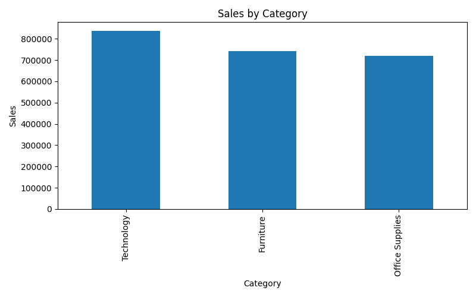
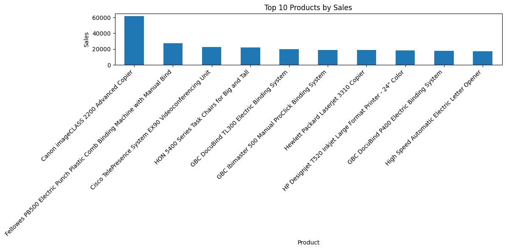
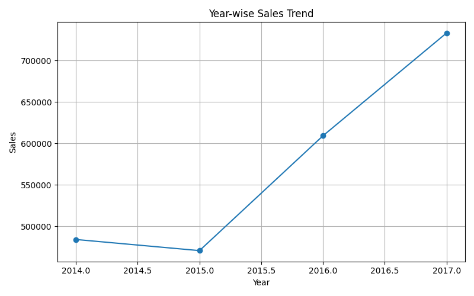

📊 Python Sales Analysis

🚀 Project Overview

This project performs Exploratory Data Analysis (EDA) on the Superstore Sales Dataset using Python. The analysis focuses on sales performance, profitability, product performance, category trends, and yearly sales trends.

The goal is to transform raw sales data into meaningful business insights through data analysis and visualization.

🛠️ Tools & Technologies

- Python
- Pandas
- NumPy
- Matplotlib
- Jupyter Notebook

📂 Dataset

The project uses the Superstore Sales Dataset containing sales transactions, customer information, product categories, regional data, and profitability metrics.

🎯 Business Objectives

- Analyze overall sales and profit performance
- Identify top-performing products
- Compare sales across categories
- Compare profit across categories
- Analyze yearly sales trends
- Generate actionable business insights

🔍 Data Quality Assessment

Check| Result
Missing Values| 0
Duplicate Records| 0

The dataset was clean and required minimal preprocessing before analysis.

📌 Key Findings

Overall Business Performance

- Total Sales: $2,296,919
- Total Profit: $286,409

Category Analysis

- Technology generated the highest sales.
- Technology generated the highest profit.
- Furniture generated the lowest profit among all categories.

Product Analysis

- Canon products recorded the highest sales among all products.

Trend Analysis

- Sales were analyzed from 2014–2017.
- Year-wise sales trends showed overall business growth.
- Line charts were used to visualize sales performance over time.

📷 Visualizations

## 01. Profit by Category

## 02. Sales by Category

## 03. Top 10 Products by Sales

## 04. Year-wise Sales Trend

📁 Project Structure

python-sales-analysis/

├── data/
├── notebooks/
├── screenshots/
├── README.md
└── requirements.txt

💪 Skills Demonstrated

- Data Cleaning
- Exploratory Data Analysis (EDA)
- Data Visualization
- Business Insight Generation
- Python Programming
- Pandas
- NumPy
- Matplotlib

👨‍💻 Author

Narendra Patil

BCA Student | Aspiring Data Analyst

Skills:
- Power BI
- SQL
- Excel
- Python
- Data Visualization
- Business Analytics

 Connect With Me

- LinkedIn: https://www.linkedin.com/in/narendra-patil-637aa8343
- GitHub: https://github.com/narendra-p09

---
